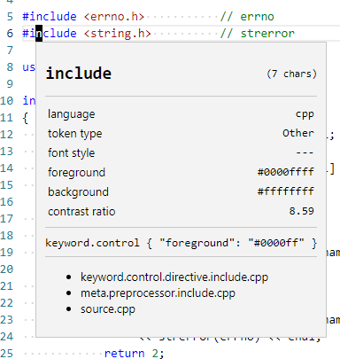

# Creating a Theme

## Make a minimal theme

A minimal theme has two files:

1. `package.json`
2. A color theme JSON file in the `themes` directory.

A minimal `package.json` for a theme is:

```
{
    "name": "mytheme",
    "displayName": "mytheme",
    "description": "",
    "version": "0.0.1",
    "engines": {
        "vscode": "^1.37.0"
    },
    "categories": [
        "Themes"
    ],
    "contributes": {
        "themes": [
            {
                "label": "mytheme",
                "uiTheme": "vs", // or "vs-dark"
                "path": "./themes/mytheme-color-theme.json"
            }
        ]
    }
}
```

The minimal `mytheme-color-theme.json` is:

```
{
    "$schema": "vscode://schemas/color-theme",
    "name": "mytheme",
    "colors": {
    },
    "tokenColors": [
    ]
}
```

With just these two files, the theme can be tested with menu item Debug
→ Start Debugging (F5).  Further changes to the theme JSON file will be
reflected in the debuggee VSCode as soon as the file is saved.

This minimal theme has no color specifications at all.  Consequently, it
uses the defaults for either the light or dark theme classes, depending
on how `uiTheme` is set in `package.json`.

## Copy in settings from another theme

At this point we want to populate the theme with color settings from
some other theme, if for no other reason than to have easy access to the
list of names of things that need colors.

Take a look at the [built-in themes](https://github.com/microsoft/vscode/tree/master/extensions/theme-defaults/themes)
in the VSCode sources.  I will choose `light_vs.json` as my starting
point.  We need two things: the `colors` object and the `tokenColors`
array.  `light_vs.json` does not actually contain the `colors` object;
instead, it has an `include` attribute that pulls its `colors` from
`light_defaults.json`.  So, open `light_defaults.json` and copy and
paste its `colors` object into your theme colors JSON object.  Then,
from `light_vs.json`, copy and paste its `tokenColors` array into your
JSON file.

As soon as you save the theme colors JSON file, the debuggee VSCode will
show the new colors.  You now have a fully editable copy of your chosen
base theme!

## Editing the colors object

The `colors` object controls the appearance of the GUI elements *other
than* text in the main text editor area.  It also controls the "default"
text editor text appearance through its `editor.foreground` and
`editor.background` attributes; that is, any text that is not subject to
a `tokenColors` specification gets the default colors.

The [reference page](https://code.visualstudio.com/api/references/theme-color)
describes the many available colors adequately, and the process of
changing them is fairly straightforward.

One hint though: when you change `editor.background`, the background of
the row of tabs along the top, as well as the breadcrumbs below it, also
change.  Thus, if you change the background color, you probably also
want to set `tab.activeBackground` and `breadcrumb.background`.

## Editing the tokenColors array

The `tokenColors` array controls the appearance of text in the main editor
area (aside from the default foreground and background colors).

Each element in the array has two attributes: `scope` and `settings`.  The
`scope` says which text that element applies to, and `settings` specifies
how that text should appear.  (There is also an allowable `name` attribute
that has no apparent effect.)

### Token scope

Let's start by choosing some syntax to target.  I will initially target
the "include" word of C++ `#include` preprocessor directives.  With a
C++ source file open, in the debuggee VSCode, run the command
"Developer: Inspect TM Scopes".  Put the cursor on "include" (not the
leading `#` symbol).  You will see:



At the bottom of this popup window we see:

* keyword.control.directive.include.cpp
* meta.preprocessor.include.cpp
* source.cpp

For the chosen character ("n" in the screenshot), these are all of the
*scope names* that have been applied to it, from innermost (top) to
outermost (bottom) nesting.  Each scope name is a dotted sequence of
words that describe the token the character is in, from least specific
(left) to most specific (right).  The final word indicates the source
code language (here "cpp", meaning C++), which seems *less* specific
than earlier words when thinking about just one language, but from the
perspective of a multi-language text editor, it acts like a further
increase in specificity.

The `scope` attribute is either a string or an array of strings.  When a
single string, it is a *scope selector*.  A scope selector
*matches* a scope name if and only if the selector is a *prefix* of (or
equal to) the name, when both are treated as a sequence of dot-separated
words.  If two scope selectors both match the same scope name, the
selector that matches more of that name takes precedence.  If two
elements both have scope selectors that match a scope name associated
with a character, but the scope names are different, the element that
matches the *innermost* scope name takes precedence.  That is, for a
given character, the selected `tokenColors` element (if any) is the one
that matches the longest prefix of the innermost matched scope name.

In our example of the `include` token, we have:

* "source.cpp" takes precence over "source" (longer match of same scope name)
* "meta" takes precedence over "source.cpp" (matches inner scope)
* "key" does not match (not a complete word)
* "cpp" does not match (not a prefix of a scope name)
* "keyword.control.directive.include.cpp" is the highest precedence
  selector without any descendant selector (discussed next)

Furthermore, a scope selector can contain multiple space-separated
dotted word sequences, for example "meta.preprocessor keyword.control".
These are *descendant selectors*; the example applies to "keyword.control"
when it appears inside "meta.preprocessor".  The precedence rules for
descendant selectors are
[described in the TextMate manual](https://macromates.com/manual/en/scope_selectors#ranking_matches),
but VSCode does not seem to implement them correctly (in particular,
resolution of "a c" versus "b c" does not seem to work).

If two `tokenColors` elements specify exactly the same `scope`, then the
one that appears *last* in the JSON file takes effect, while the others
are ignored.  (I believe this is done in order to allow a file to
`include` another and then override it.)
TODO: This is not right.  Multiple elements can match and contribute
different elements of the appearance, namely `fontStyle` and `color`.

If no element matches a given character's scope names, that character is
assigned the default text color and no font style.

If `scope` is an array, it is equivalent to a sequence of elements that
all have the same `settings` and one each of the `scope` array elements,
in turn.

(Disclaimer: The preceding specification was determined through
experimentation, as I could not find an authoritative reference for the
semantics of `tokenColors` in VSCode, which behaves differently from
[TextMate](https://macromates.com/manual/en/scope_selectors).  It may be
inaccurate or incomplete.)

Note that a theme's color definitions are applied to all languages; each
language definition classifies text into scopes as it sees fit, but the
theme must then map *all* scopes to colors.

### Token settings

The `settings` attribute is an object with the following available
attributes:

* `foreground`: Text color in one of these formats: "#RGB", "#RGBA",
  "#RRGGBB", or "#RRGGBBAA".
* `background`: **Not implemented**, as of VSCode 1.37.1.
* `fontStyle`: Font style, from among "italic", "bold", "underline", or a
  space-separated set of those.

These styles are applied to characters for which the associated
`tokenColors` element has the highest precedence.

## Decorations

Completely independent of the TextMate scopes,
[decorations](https://code.visualstudio.com/api/references/vscode-api#window.createTextEditorDecorationType)
can be applied to text by an extension.  These optionally override
the TextMate scope styles and have additional styling capabilities
such as changing the background color, drawing a border, changing
the font size, and others.  This guide is not about decorations,
but one should be aware of their existence.  This
[Stack Overflow answer](https://stackoverflow.com/a/57722269/2659307)
explains how to identify when a decoration is present.

## References

[Theme colors](https://code.visualstudio.com/api/references/theme-color)

The [TextMate Language Scope Selectors Manual](https://macromates.com/manual/en/scope_selectors)
explains scope names and scope selectors.  However, VSCode does not
implement everything described; in particular, "Excluding Elements"
does not work in VSCode.

The [VSCode theme tutorial](https://code.visualstudio.com/api/extension-guides/color-theme)
is pretty short.  It also misleadingly suggests that there is a `type`
field in the color theme JSON that controls light versus dark; that is
wrong, it is controlled by the `uiTheme` attribute in `package.json`.

[JSON schema for color theme files](https://github.com/microsoft/vscode/blob/master/src/vs/workbench/services/themes/common/colorThemeSchema.ts)
in the VSCode sources.
